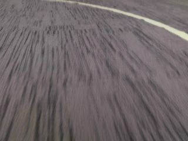

# Simulator ROS bag
### Simulator RoboCars topics Video, PWM value for steering and speed



* Set and export URI ROS MASTER NODE TARGET
> export ROS_MASTER_URI=http://localhost:11311

Start docker-compose:
> docker-compose up

View Render in the container display:
> rostopic echo /usb_cam/image_raw/compressed

init display node :
```
  publish_1     | [ INFO] [1546696246.219139100]: Opening /rosbag/2018-12-15-02-11-36.bag
  publish_1     |
  display_1     | header:
  display_1     |   seq: 2
  display_1     |   stamp:
  display_1     |     secs: 1546696246
  display_1     |     nsecs: 219189400
  display_1     |   frame_id: ''
  display_1     | level: 2
  display_1     | name: "/play_1546696246207237300"
  display_1     | msg: "Opening /rosbag/2018-12-15-02-11-36.bag"
  display_1     | file: "/tmp/binarydeb/ros-kinetic-rosbag-1.12.14/src/player.cpp"
  display_1     | function: "Player::publish"
  display_1     | line: 132
  display_1     | topics: [/rosout, /clock]
  display_1     | ---
  publish_1     | Waiting 0.2 seconds after advertising topics... done.
```
